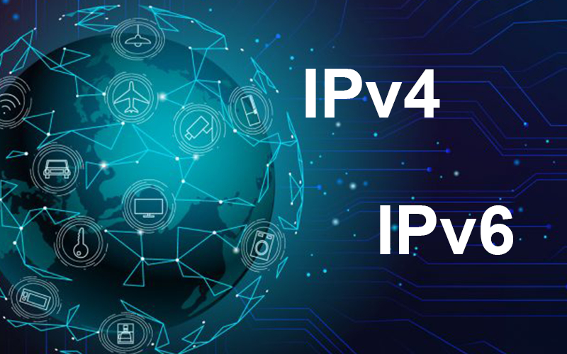
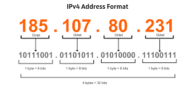

# IPv4

<div align="center">
  
</div>

El **Protocolo de Internet versión 4 (IPv4)** constituye el sistema fundamental de interconexión de redes que utiliza direcciones de `32 bits` para identificar dispositivos en **ARPANET** e **Internet**. 

Debido al **crecimiento global**, el suministro limitado se agotó oficialmente en 3 de Febrero 2011, impulsando la transición hacia el estándar **IPv6**. 

---

### ¿Qué es IPv4 y de dónde viene?

* Fue la primera versión usada en producción real, implantada en **1983 en ARPANET**.
* Su función es **identificar** dispositivos y **permitir** el encaminamiento de paquetes entre redes.
* Usa **2³² = 4.294.967.296** direcciones
```
1. Crecimiento masivo de Internet
2. Automatización
3. Dispositivos móviles
4. IoT
5. Mala planificación inicial
```
---

### Direccionamiento IPv4 
 

#### Ip privada: 192.168.1.3
```
* 192 → parte de la red *“familia de red”*
* 168 → parte de la red *“subfamilia”*
* 1 → subred concreta *“barrio dentro de la red”*
* 3 → host (dispositivo)
```

----


🟢 **APARTADO I**

* ¿Qué identifica una dirección IP: un usuario, un dispositivo o una red?
* ¿Cuántos bits tiene una IPv4?
* ¿Cuántas direcciones totales permite IPv4?
* ¿Qué diferencia hay entre parte de red y parte de host?
* ¿Para qué sirve la máscara de subred?

🔵 **APARTADO II**

* ¿Puede una IP privada circular por Internet? ¿Por qué?
* Si millones de dispositivos usan 192.168.x.x, ¿por qué no hay conflictos entre casas?
* ¿Quién “ve” realmente esa IP: Internet o solo la red local?
* ¿Qué diferencia hay entre IP privada e IP pública?
* Pon 3 rangos de IPs privadas.
* ¿Quién asigna las IPs públicas en el mundo?

🟣 **APARTADO III**

* ¿Qué es DHCP, y qué problema resuelve?
* ¿Dónde suele estar el servidor DHCP en una casa?
* ¿Qué información entrega DHCP además de la IP?
* ¿Qué es un “lease” o concesión?
* ¿Por qué DHCP evita conflictos de IP duplicadas?
* ¿Podría funcionar una red sin DHCP? ¿Cómo?

🔴 **APARTADO IV**

* ¿Qué es NAT?
* ¿Por qué NAT fue necesario en IPv4?
* ¿Qué modifica el router al aplicar NAT: IP, puerto o ambos?
* ¿Por qué los puertos son necesarios en NAT?
* ¿Cómo puede un solo router permitir que 10 dispositivos naveguen a la vez con una sola IP pública?
* ¿Qué guarda el router en la tabla NAT?
* ¿Qué vería Google como IP de origen: la privada o la pública?
* ¿Puede Internet iniciar una conexión directamente hacia tu móvil? ¿Por qué?
* Ordena correctamente: DHCP – NAT – Router – Internet.
* ¿Qué desventajas tiene NAT?
* ¿Por qué NAT rompe la comunicación directa entre dispositivos?

---


