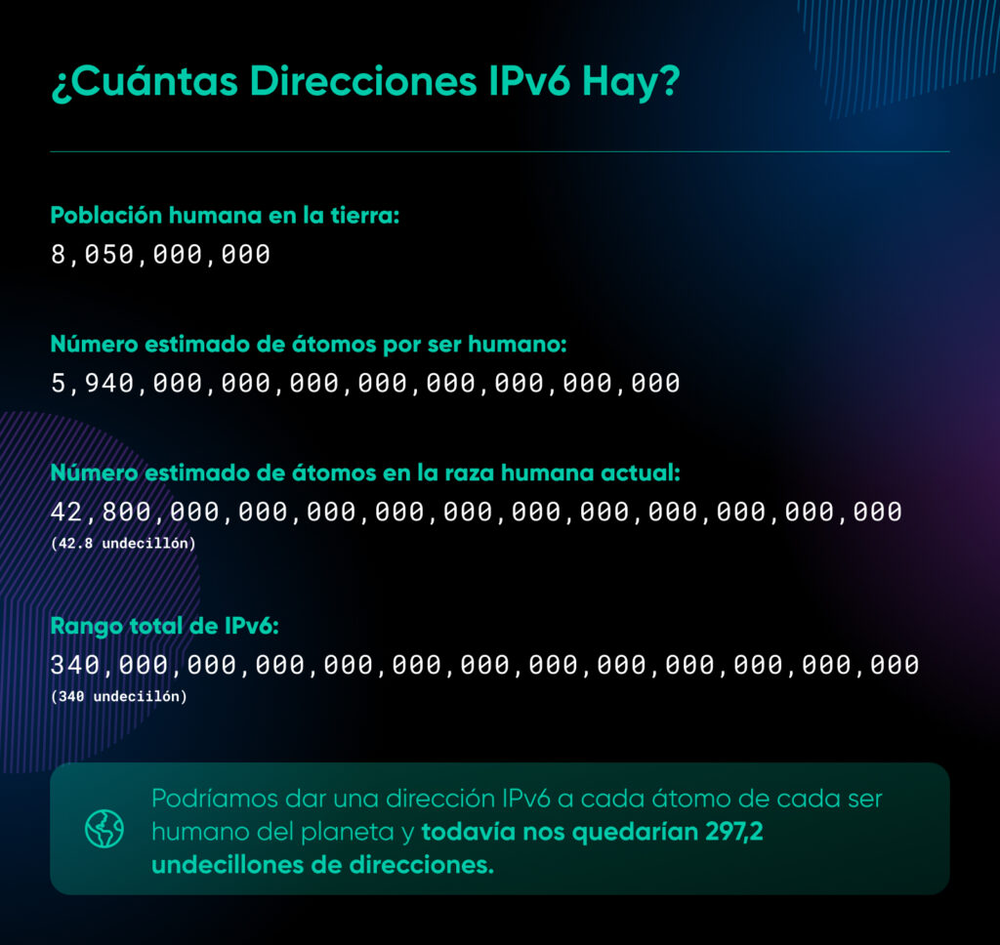

# IPv6 - Protocolo de Internet versión 6

**IPv6** (Internet Protocol version 6) es la versión más reciente del Protocolo de Internet (IP), la capa de comunicaciones que proporciona un sistema de identificación y localización para ordenadores en redes y enruta el tráfico a través de Internet. IPv6 fue desarrollado por el *Internet Engineering Task Force* (IETF) para abordar el agotamiento a largo plazo de direcciones IPv4.

| **Aspecto** | **Detalle** |
|-------------|-------------|
| **Estado** | Estándar de Internet (RFC 8200) |
| **Introducido** | Diciembre de 1998 |
| **Reemplaza a** | IPv4 (RFC 791) |
| **Longitud de dirección** | 128 bits |
| **Espacio de direcciones** | 3.4×10³⁸ direcciones |
| **Notación** | Hexadecimal, ocho grupos de cuatro dígitos |

---

El desarrollo de IPv6 comenzó a principios de la década de 1990 cuando se hizo evidente que el espacio de direcciones de 32 bits de IPv4 (aproximadamente 4.300 millones de direcciones) sería insuficiente para el crecimiento futuro de Internet. La IETF formó el Grupo de Trabajo de IP de Próxima Generación (IPng) en 1994 para estandarizar el protocolo.

### Publicación del estándar
La especificación inicial de IPv6 se publicó como **RFC 1883** en diciembre de 1995. La versión actual del estándar es **RFC 8200**, publicada en julio de 2017, que obsoleta el RFC 2460.

### Línea de tiempo clave
- **1994**: Formación del grupo de trabajo IPng
- **1995**: RFC 1883 (primera especificación)
- **1998**: RFC 2460 (especificación principal)
- **2008**: ICANN añade registros AAAA al DNS raíz
- **2011**: Agotamiento del pool central de IPv4 (IANA)
- **2012**: Lanzamiento mundial de IPv6 (World IPv6 Launch)
- **2017**: RFC 8200 (estándar actual)

## Motivación y desarrollo

### Agotamiento de IPv4
El principal impulsor para IPv6 fue el **agotamiento del espacio de direcciones IPv4**. El último bloque de direcciones IPv4 fue asignado por la IANA a los Registros Regionales de Internet (RIR) el 3 de febrero de 2011.

---

### Limitaciones de IPv4
1. **Espacio de direcciones insuficiente**
2. **Complejidad del enrutamiento** debido a fragmentación CIDR
3. **Falta de características de seguridad integradas**
4. **Configuración manual** o dependencia de DHCP
5. **NAT extensivo** que rompe el modelo end-to-end

