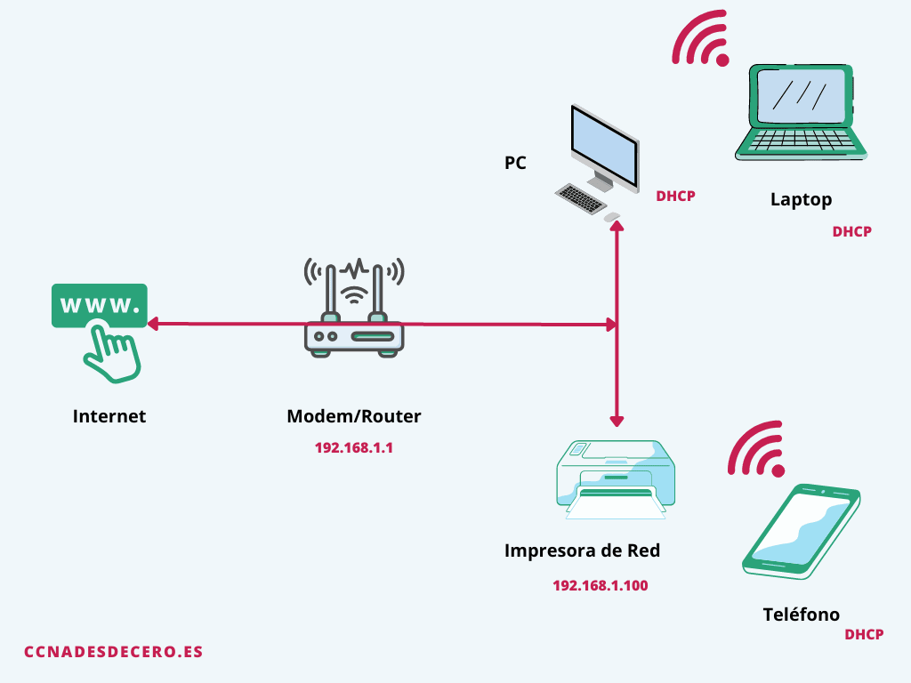

# 🔐 Seguridad en redes

  

--- 

## 1. ¿Por qué importa la seguridad en redes?

Cada vez que un dispositivo se conecta a una red, intercambia información que puede ser valiosa o sensible.

Hoy en día, casi todo lo que hacemos pasa por una red: 
- enviar mensajes,
- acceder a plataformas educativas,
- trabajar en remoto,
- pagar con el móvil o ver contenido en streaming.
  
### 2. Si una red no está protegida, esa información puede:

- ser `interceptada` por terceros,
- `alterarse` durante el envío,
- quedar `inaccesible`por ataques o fallos.

---

### 3. La seguridad en redes es, por tanto:

* la primera `línea de defensa` frente a amenazas digitales.
* No solo protege datos personales y empresariales, sino que `garantiza` que los sistemas funcionen correctamente y de forma `continua`. 
* Una `red insegura` pone en riesgo todo lo que depende de ella.

Por eso es fundamental conocer y aplicar mecanismos básicos como Wi-Fi segura (WPA2/WPA3), VPN y firewalls, que permiten proteger las comunicaciones y reducir los riesgos en cualquier entorno conectado.

En una red, los datos viajan por cables o por el aire (Wi-Fi). Si no protegemos la red, alguien puede:

| #  | Amenaza                                                          | Tipo de ataque en ciberseguridad                     |
|----|------------------------------------------------------------------|------------------------------------------------------|
| 1  | **Escuchar** el tráfico (robo de datos)                          | **Sniffing / Eavesdropping**                         |
| 2  | **Manipular** comunicaciones (cambiar lo que llega)              | **Man-in-the-Middle (MitM)**                         |
| 3  | **Bloquear servicios** (dejarte sin conexión)                    | **Denegación de Servicio (DoS/DDoS)**                |
| 4  | **Suplantar** identidades en la red                              | **Spoofing (IP/ARP/DNS)**                            |
| 5  | **Entrar** en dispositivos no protegidos                         | **Explotación de vulnerabilidades**                  |
| 6  | **Propagación** automática de malware                            | **Gusanos (Worms) / Malware de red**                 |
| 7  | **Descubrir** información sensible de la red                     | **Footprinting / Escaneo de puertos**                |
| 8  | **Secuestrar** sesiones activas de usuarios                      | **Hijacking de sesión / Cookie theft**               |
| 9  | **Engañar** a usuarios para que revelen credenciales             | **Phishing / Ingeniería social**                     |
| 10 | **Crear redes falsas** para atraer víctimas                      | **Evil Twin / Rogue Access Point**                   |
| 11 | **Modificar datos** en tránsito para dañar sistemas              | **Data tampering / Integrity attack**                |
| 12 | Negar que se envió o recibió un mensaje                          | **Ataque de no repudio (Repudiation)**               |
| 13 | **Anular** mecanismos de cifrado o autenticación                 | **Cryptographic attack / Authentication bypass**     |
| 14 | **Agotar recursos de red** (como direcciones IP)                 | **DHCP starvation / Resource exhaustion**            |

---

- **Confidencialidad:** que no lo lea quien no debe.
- **Integridad:** que no lo modifiquen.
- **Disponibilidad:** que el servicio funcione.

---

## 4. Wi-Fi segura: del WPA2 al WPA3

### WPA2 (lo clásico)
**WPA2** ha sido el estándar más usado durante años.
- Usa **AES** para cifrar el tráfico (cifrado fuerte).
- Normalmente se configura como **WPA2-PSK** (una contraseña para todos).

**Punto clave:** aunque el cifrado sea fuerte, el sistema puede sufrir ataques si la contraseña es débil o si se explotan vulnerabilidades del protocolo.

<!--📷 *Imagen sugerida:* icono de candado + “AES” + “WPA2”.-->

---

### 5. Vulnerabilidades conocidas (idea general)

Con el tiempo se han encontrado fallos en cómo se negocian claves o se gestiona la conexión. 

**Traducción a lenguaje simple:** no significa que “WPA2 no sirva”, sino que **hay casos donde un atacante experto puede aprovechar debilidades** si se cumplen ciertas condiciones.

📷 *Imagen sugerida:* línea de tiempo: WPA2 → (KRACK 2017) → WPA3.

---

### 2.3. WPA3 (el salto)
**WPA3** mejora la seguridad, sobre todo contra:
- contraseñas adivinables,
- ataques de diccionario,
- capturas que luego se prueban “offline”.

Cambia la autenticación típica de WPA2-PSK por **SAE** (*Simultaneous Authentication of Equals*).

**SAE explicado fácil:**
- En WPA2-PSK, si alguien captura el “saludo” de conexión, puede intentar adivinar la contraseña **sin estar conectado** muchas veces (offline).
- En WPA3-SAE, esos intentos son mucho más difíciles: **cada intento obliga a interactuar**, y el protocolo está diseñado para resistir mejor fuerza bruta.

📷 *Imagen sugerida:* comparación visual:
- WPA2: “capturo handshake → pruebo miles offline”
- WPA3: “necesitas interacción → más difícil y más lento”

---

## 3. WPA2 vs WPA3 (comparativa rápida)

| Característica | WPA2 | WPA3 |
|---|---|---|
| Cifrado | AES (habitual) | AES (mejoras en el proceso de autenticación) |
| Autenticación doméstica | PSK (contraseña compartida) | SAE (más resistente a fuerza bruta) |
| Ataques de diccionario offline | Más viable si capturas tráfico y la clave es débil | Mucho más difícil |
| Recomendación actual | Solo si WPA3 no está disponible | Preferido siempre que se pueda |

📷 *Imagen sugerida:* tabla convertida a infografía.

---

## 4. Ejemplos prácticos (muy claros)

### Ejemplo 1: Casa / piso compartido (configuración recomendada)
**Objetivo:** Wi-Fi segura sin complicarse.
1. Activar **WPA3-Personal** (o **WPA2/WPA3 mixed** si hay dispositivos antiguos).
2. Contraseña larga: **mínimo 14–16 caracteres**, con frases tipo:
   - `M
