# 🧰 Tipos de Almacenamiento - HDD, SSD, NVMe y Cloud Storage

- El almacenamiento es uno de los pilares de cualquier sistema informático. 
- Sin un medio confiable donde guardar los datos, ningún ordenador o servidor podría funcionar correctamente. 
- No todos los tipos de almacenamiento son iguales en: 
  - **Velocidad:** 100–200 MB/s
  - **Durabilidad:** 3–5 años
  - **Consumo:** 6–9 W
  - **Precio:** 0,02–0,04 €/GB
  - **Tipo de uso:** 1–20 TB

---

## 📐 La Pirámide del Almacenamiento

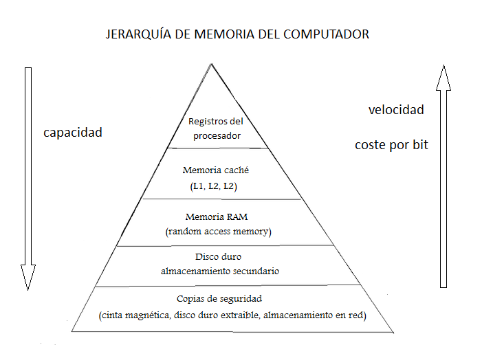

El **almacenamiento** se organiza en niveles donde la cima es la `velocidad` y la base es la `capacidad/economía`.

- **Nivel 1:** Caché / RAM (No persistente)
- **Nivel 2:** NVMe (Velocidad extrema)
- **Nivel 3:** SSD (Equilibrio óptimo)
- **Nivel 4:** HDD y Cloud Storage (Capacidad y Acceso)

---

### 💽 HDD (Hard Disk Drive) 

**¿De qué está compuesto?**

- Platos magnéticos: Discos rígidos apilados que giran a alta velocidad (5400-7200 RPM)
- Brazo mecánico: Con cabezal de lectura/escritura que se mueve sobre los platos.
- Motor: Hace girar los platos constantemente
- Carcasa sellada: Protege el mecanismo del polvo

  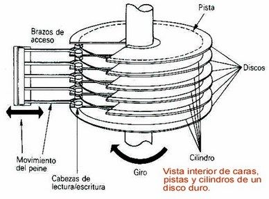 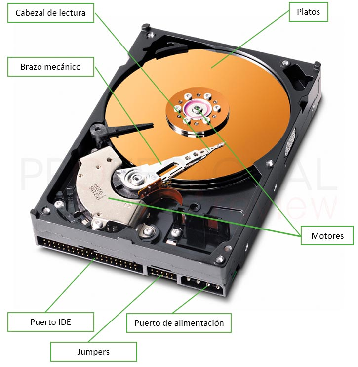 

*Los platos giran mientras un brazo mecánico se mueve hacia la posición correcta para leer/escribir datos magnéticamente. Es como un tocadiscos dentro de una caja metálica.*

**¿Cómo se almacena el dato?**

- Los datos se guardan magnéticamente.
- Los platos están recubiertos de material ferromagnético.
- Cada bit es una orientación magnética:
  - Norte → Sur = 1
  - Sur → Norte = 0
---

### 💽 SSD (Solid-State Drive) 

**¿De qué está compuesto?**

- Memoria flash NAND. No tiene piezas mecánicas, por eso es rápido y resistente.
- Guarda los datos en chips electrónicos, similar a una memoria USB pero mucho más veloz.
- Velocidad típica: Más de 500 MB/s (los modelos NVMe pueden ser aún más rápidos).

**Ventajas**

- Arranque rápido
- Menor consumo
- Sin ruido
- Resistente a golpes
- Ligero
- Estrategia de uso
- Ideal para sistema operativo, programas, internet y juegos.

¿Wear Leveling?

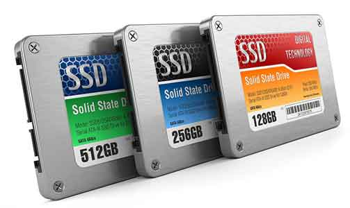 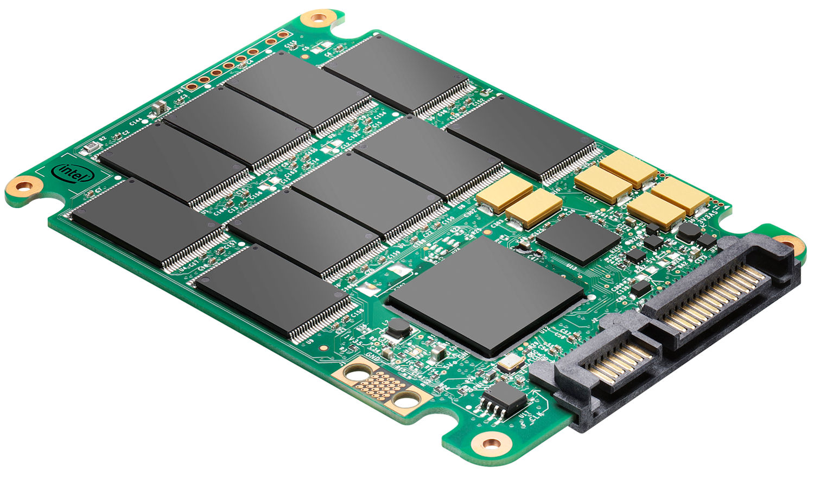 

**🔬 ¿Cómo se almacena el dato?**

Se guarda como carga eléctrica atrapada en un transistor especial llamado: **Transistor de puerta flotante (Floating Gate)**

Cada celda NAND:

- Puede almacenar electrones.
- Si hay carga → representa un valor.
- Si no hay carga → otro valor.

📊 Según tipo de celda:

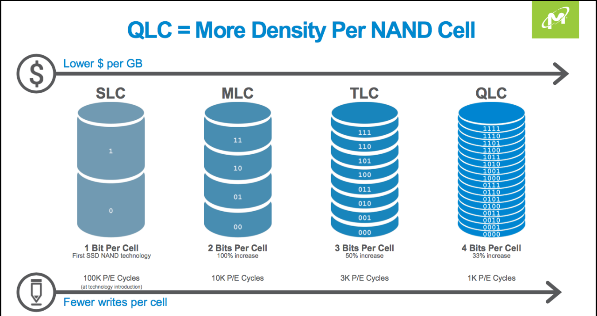

|Tipo	|Bits por celda	|Estados eléctricos|
|-----|---------------|------------------|
|SLC	|1 bit	        |2 estados         |
|MLC	|2 bits	        |4 estados         |
|TLC	|3 bits	        |8 estados         |
|QLC	|4 bits	        |16 estados        |

Más bits → más precisión necesaria → más desgaste.

📌 Qué implica

- No hay partes móviles.
- Se necesita borrar antes de escribir.
- Hay límite de ciclos de escritura.

---

### 💽 NVMe (Non-Volatile Memory Express)

No es un disco distinto por dentro, sino la forma en la que el SSD se comunica con el ordenador.

**Qué lo hace diferente**

Un SSD SATA usa el conector SATA, que tiene un límite de velocidad.
NVMe usa PCIe, que es mucho más rápido, por eso puede alcanzar varios miles de MB/s.

**¿Por qué es más rápido?**

- Puede enviar muchas órdenes a la vez (paralelismo).
- Reduce la latencia (menos tiempo de espera).
- Aprovecha mejor los procesadores actuales.
- Velocidad orientativa:
  - HDD ≈ 100–150 MB/s
  - SSD SATA ≈ 500–550 MB/s
  - NVMe ≈ 3.000 – 7.000 MB/s (según generación PCIe)
    
    
**¿Cuándo se usa?**

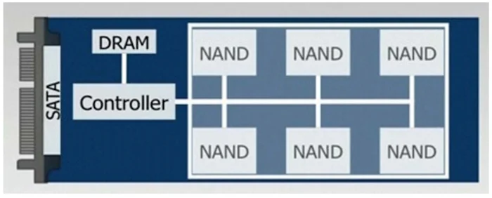

- Edición de vídeo pesada
- Desarrollo y máquinas virtuales
- Bases de datos y análisis de datos
- Gaming con cargas rápidas
- Almacenamiento en la nube (relación)

Muchos servidores cloud usan NVMe porque:

- Manejan miles de accesos simultáneos
- Necesitan tiempos de respuesta muy bajos
- Mejoran el rendimiento de apps y bases de datos online.

---

### 💽🌐 Cloud Storage 

**¿Cómo funciona?**

Los datos residen en centros de datos de proveedores (Google, Microsoft, Amazon) y se accede vía Internet.

**Ventajas:** Acceso desde cualquier dispositivo, colaboración en tiempo real, respaldo remoto

**Desventajas:**	Dependencia total de Internet, costos mensuales escalables, seguridad gestionada por terceros

**Estrategias de uso:**

- **Colaboración:** Editar un mismo documento con un equipo en tiempo real
- **Movilidad:** Acceder a archivos desde cualquier dispositivo
- **Respaldo Remoto (Offsite):** La capa final de la estrategia de backup
- **Proveedores principales:** Google Drive, Microsoft OneDrive, Amazon S3, Dropbox

Estrategia Profesional: Combinar, no Elegir
La "Estantería Inteligente" del profesional

---
### ESQUEMA VISUAL

 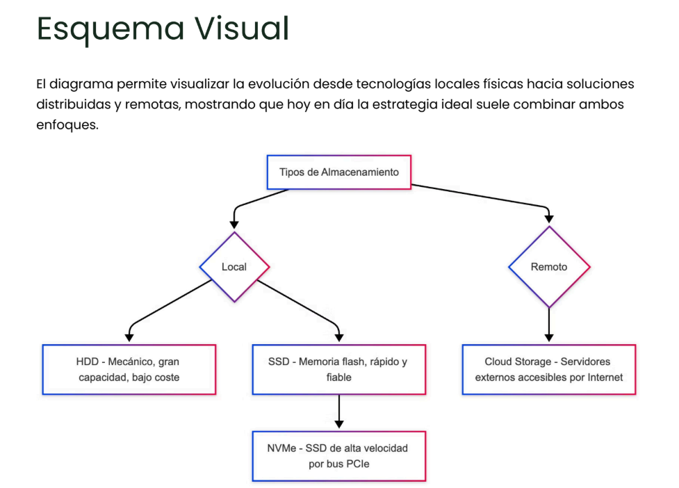

---
## 🛠️ Herramientas de gestión de almacenamiento

| Herramienta | Para qué sirve |
|---|---|
| **CrystalDiskInfo (Windows)** | Ver temperatura, horas de uso y estado S.M.A.R.T. del disco. |
| **GSmartControl (Linux / macOS)** | Diagnóstico y comprobación de salud del almacenamiento. |
| **Samsung Magician / Crucial Storage Executive** | Optimización oficial del fabricante: firmware, rendimiento y mantenimiento. |
| **rclone** | Sincronizar archivos y automatizar copias entre PC y servicios cloud. |

*Los SSD **no deben desfragmentarse**. Genera escrituras innecesarias y reduce su vida útil.*  

*Usa **TRIM**, que limpia bloques internos y mantiene el rendimiento.*

---

## 🔐 Regla 3-2-1: Estrategia profesional de copias de seguridad

La regla **3-2-1** es una metodología sencilla para reducir el riesgo de pérdida de datos.  
Se basa en diversificar copias y ubicaciones para evitar fallos únicos.

**3 copias de los datos**
- 1 copia principal (la que usas normalmente).
- 2 copias adicionales de respaldo.
- Si un archivo se borra o se corrompe, siempre existe otra versión disponible.

**2 tipos de almacenamiento diferentes**
- Evita depender de una sola tecnología.
- Ejemplos:
  - SSD interno + disco duro externo.
  - PC + NAS.
  - SSD + almacenamiento cloud.
- Reduce riesgos por fallos físicos o errores del sistema.

**1 copia fuera de la ubicación física**
- Protege frente a robos, incendios, daños eléctricos o desastres.
- Puede ser:
  - Nube (Google Drive, OneDrive, S3…)
  - Disco guardado en otra ubicación.

---

## 🛠️ Herramientas y Consejos

  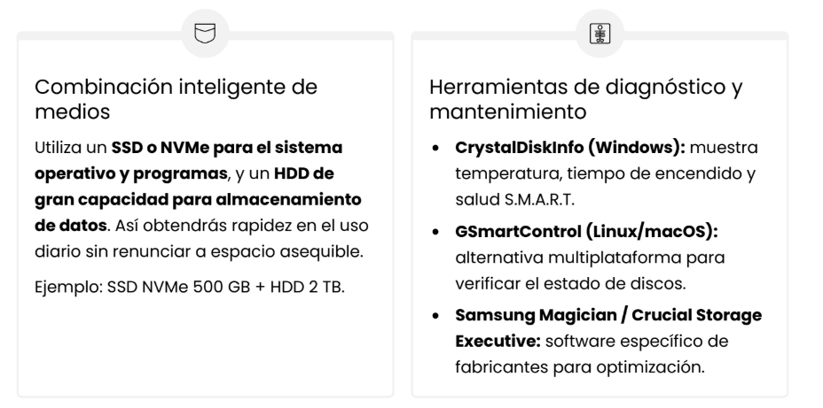
  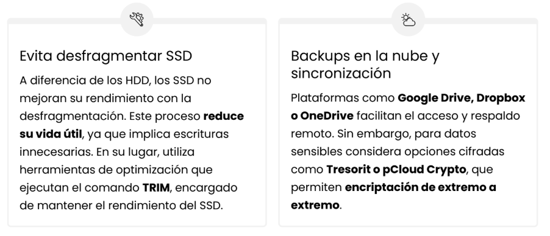
  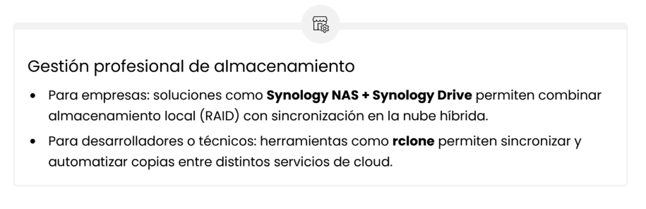

---

## 🧪 Ejercicios prácticos I

1. ¿Cuánto pesaba el primer disco duro de la historia y qué capacidad tenía?

2. ¿Cuánto costaba un disco duro de 1 GB en 1980 y cuánto pesaba?

3. ¿Qué eran los "packs de discos" removibles de los años 60 y cómo funcionaban?

4. ¿Cuánto ha aumentado la densidad de almacenamiento en los últimos 50 años?

5. ¿Cómo se fabricaban los discos duros antes comparado con ahora?

6. ¿Qué empresa fabricó el primer disco duro y en qué año?

7. ¿Cuándo aparecieron los primeros SSD comerciales y qué capacidad tenían?

8. ¿A qué distancia vuela el cabezal de un HDD sobre el plato?

9. ¿Qué significa MTTF y por qué no significa que tu disco dure 116 años?

10. ¿Por qué los discos duros modernos usan helio en su interior?

11. ¿Qué profesionales trabajan en el diseño de discos duros actualmente?

12. ¿Qué son los sectores defectuosos y cómo se gestionan?

13. ¿Cómo afectan las vibraciones externas al rendimiento de un disco?

14. ¿Qué es el "efecto servoposicionamiento" y por qué es crítico?

15. ¿Cómo funciona exactamente una celda de memoria NAND en un SSD?

16. ¿Qué diferencia hay entre celdas SLC, MLC, TLC y QLC en SSD?

17. ¿Por qué los SSD NVMe son más rápidos que los SSD SATA?

18. ¿Es malo dejar un disco duro externo siempre conectado?

19. ¿Formatear muchas veces daña el disco?

20. ¿Se pueden recuperar los datos de un disco con sectores defectuosos?

21. ¿Los datos en un SSD apagado se pierden con el tiempo?

22. ¿Desfragmentar un SSD es recomendable?

23. ¿Los cortes de luz pueden dañar físicamente un disco duro?

24. ¿Los imanes de nevera pueden borrar un disco duro?

25. ¿El calor excesivo acorta la vida de un disco?

26. ¿Cuántos datos genera el tráfico mundial de Internet al mes?

27. ¿Cuánta información cabe en un gramo de ADN?

28. ¿Cuánto duran los discos en sistemas de videovigilancia 24/7?

29. ¿Qué es un yottabyte y cuántos discos harían falta para almacenarlo?

30. ¿Qué discos se utilizan en los centros de datos de empresas como Google?

---

## 🧪 Ejercicios prácticos II

### 🟣 Ejercicio 1. EVOLUCIÓN Memoria y Velocidad   

• Buscar información para cada tipo de memoria. 

| Año | Tipo | Capacidad típica | Velocidad lectura | Precio aproximado |
|----|----|----|----|----|
| 2005 | HDD | | | |
| 2010 | HDD / SSD | | | |
| 2015 | HDD / SSD | | | |
| 2020 | SSD | | | |
| 2025 | SSD NVMe | | | |

   • A partir de la tabla anterior crea 3 gráficas (excel) en líneas para ver la evoluación por años y por dispositivos.
   
   • ¿En 20 años que se estima sea su velocidad / capacidad?

   • ¿Qué es límite de Shannon? ¿Qué factores que determinan el Límite de Shannon?. - Nombra las 4 principales dificultades para sobrepasar el límite de Shanon.
   
   • ¿Qué propiedad ha crecido más rápido?

   • ¿Qué es la Ley de Moore?

   | Año | Transistores aproximados |
   |----|----|
   | 1971 | 2.300 |
   | 1982 | 134.000 |
   | 1993 | 3.100.000 |
   | 2006 | 291.000.000 |
   | 2020 | 39.000.000.000 |

   • ¿Qué hecho hizo que la ley de Moore se disparara y cuándo?
   
   • ¿Que tamaño tenía antes los transistores antes de la miniaturización, su relación esn % a los actuales?

   • ¿Qué tamaño tendría un disco de 1 Tb si los transistores fueran del tamaño anterior a la miniaturización?

   • Si utilizáramos la tecnología de discos duros de hace unas décadas, ¿qué tamaño físico tendría aproximadamente un sistema capaz de almacenar 1 TB de información?

---

### 🔴 Ejercicio 2. LIMPIEZA DE DISCO (Defraggler) (Máquina Virtual) 
   
   • Selecciona unidad C:
   
   • Marca: Archivos temporales, Papelera, Miniaturas
   
   • Haz clic en "Limpiar archivos del sistema"
   
   • Haz capturas de la ventan principal y cuando está desfragmentando.

   • Si existe diferentes partes menciona que es cada cosa, o con numeración en la aptura selecionada y leugo lo describes después.

   • ¿Qué es lo que no se puede desfragmentar y por qué?

---

### 🟢 Ejercicio 3. STORAGE SENSE (Windows 10/11) (Máquina Virtual) 

   • Proponer al menos **tres acciones que podrían hacerse para liberar espacio en el disco** sin borrar archivos importantes.
   
   • ¿Cuál es el proceso de Comprimir archivos de windows? ¿Qué % de eficacia hace?
  
   • Comprime un archivo grande min (50 mb) y mira las diferencias entre .rar, .zip, .7zip, para el mismo archivo.

---

### 🟠 Ejercicio 4. DIFERENCIAR

   • ¿ Qué es desfragmentación, TRIM, CHKDSK, Wear Leveling ?
   
   • Crear una presentación o esquema de cada uno de los conceptos y saber diferenciarlos.

---
