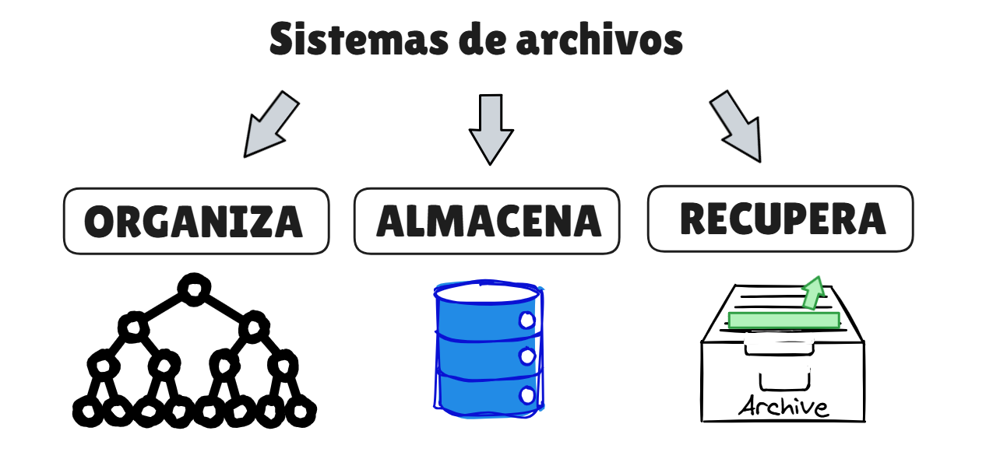
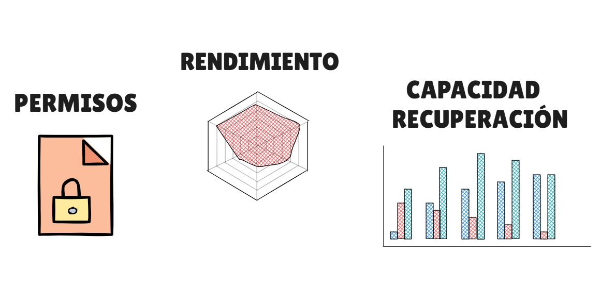
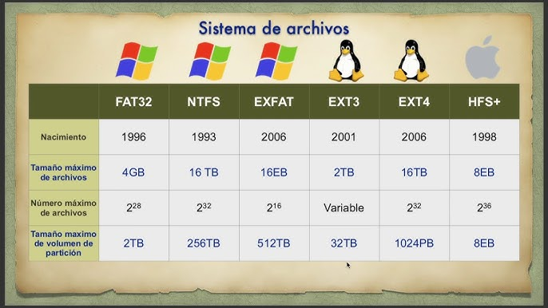
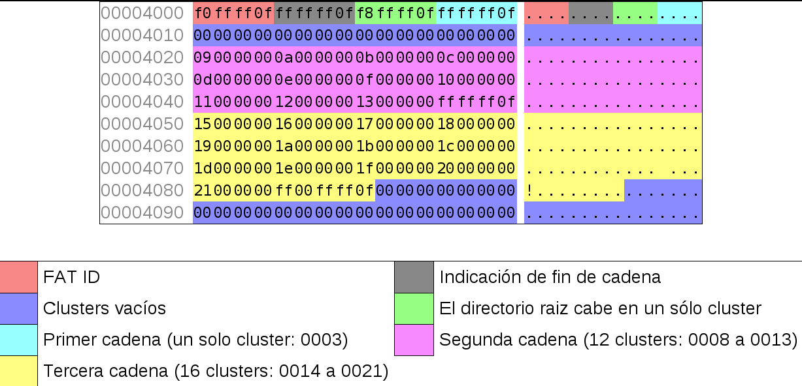
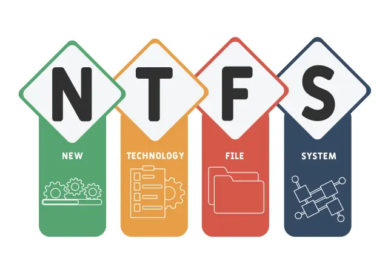
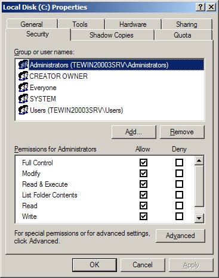
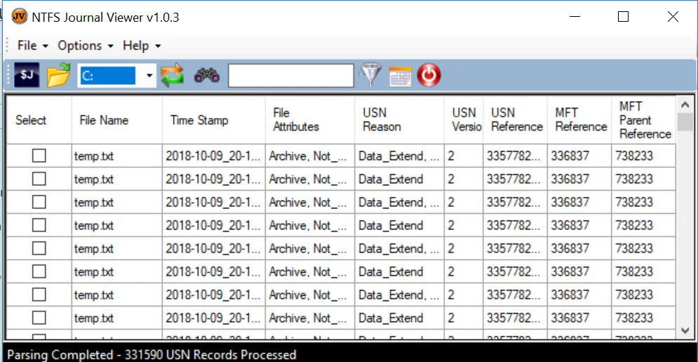
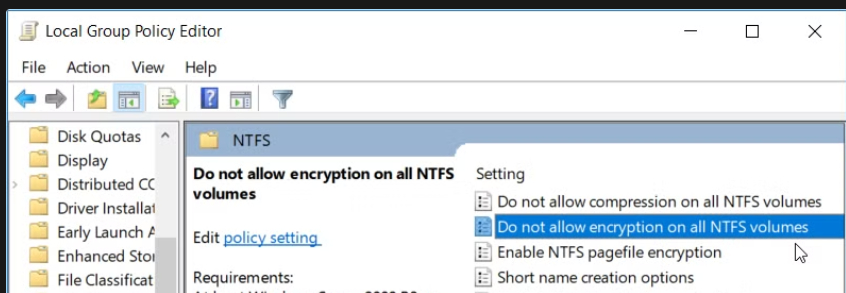

# ⚡Sistemas de archivos (NTFS, EXT4, APFS, ZFS, Btrfs)

## Introducción

Un sistema de archivos define cómo un sistema operativo.

📂 **ORGANIZA**, **ALMACENA** y **RECUPERA** la información en un dispositivo.

<p align="left">
  
</p>

👮‍♂️ **CONTROLA** la integridad de los datos, los **PERMISOS**, el **RENDIMIENTO** y la **CAPACIDAD** de recuperación ante errores.  


<p align="left">
  
</p>

Cada sistema tiene objetivos distintos: **COMPATIBILIDAD**, **ESTABILIDAD**, **OPTIMIZACIÓN**  o máxima **PROTECCIÓN** frente a corrupción.

<p align="left">
  
</p>

[FAT16](./Complement/Fat16.md)


---

## 🗃 FAT32  (Windows, Linux, macOS, cámaras, consolas, TVs)

### ¿Qué es FAT32?

- **FAT**: File Allocation Table (Tabla de Asignación de Archivos).
- Es una **tabla** o índice que **GUARDA** el sistema para saber en qué partes del disco está almacenado cada archivo.
- En lugar de guardar un archivo en un único lugar continuo, el sistema puede dividirlo en varios **clusters** (bloques del disco).
- La FAT es la estructura que registra qué bloques pertenecen a cada archivo y en qué orden se deben leer.

<p align="left">
  
</p>

---

### ¿Cómo está estructurado?

En una partición FAT32 suele haber estas zonas:

* **Boot Sector / BPB**
* **FSInfo**
* **FAT duplicado (FAT1 y FAT2)**
* **Zona de datos**

---

###  🔛 Boot Sector / BPB (sector de arranque):
  
Describe la estructura del sistema de archivos para que el sistema operativo pueda leer el disco correctamente:

- **Tamaño de sector:** Unidad física mínima del disco (normalmente 512 bytes o 4096 bytes)
- **Tamaño de cluster:** Grupo de sectores que el sistema de archivos usa para almacenar datos
- **Número de FATs**
- **Dónde empieza la zona de datos** 

| Campo | Qué indica | Para qué sirve |
|---|---|---|
| Bytes per Sector | Tamaño de cada sector del disco (ej. 512 o 4096 bytes) | Define la unidad física mínima de lectura/escritura |
| Sectors per Cluster | Cuántos sectores forman un cluster | Determina el tamaño de los bloques donde se guardan archivos |
| Reserved Sectors | Número de sectores reservados al inicio | Indica dónde empieza la FAT |
| Number of FATs | Número de copias de la FAT (normalmente 2) | Permite redundancia si una FAT se corrompe |
| FAT Size | Cuántos sectores ocupa cada FAT | Permite localizar toda la tabla FAT |
| Total Sectors | Tamaño total del volumen en sectores | Permite calcular el tamaño total del sistema de archivos |
| Root Cluster | Cluster donde empieza el directorio raíz | Punto de inicio para localizar archivos |
| FSInfo Sector | Sector que guarda información de clusters libres | Optimiza la gestión del espacio libre |
| Boot Sector Signature | Firma `55 AA` | Indica que el sector de arranque es válido |

[BootSector](https://github.com/cokeIkigai/sistemasInformaticos/blob/main/Tema3/Complement/BootSector.md)

---

### 🔎 FSInfo (típico en FAT32): 

Sirve para saber cuántos clusters libres hay en el sistema. Debe recorrer toda la FAT, lo que podía ser lento en discos grandes.

**FSInfo guarda dos datos orientativos:**

- Número estimado de clusters libres ( ¿espacio disponible? )
- Próximo cluster libre sugerido ( ¿Dónde empezar a buscar espacio libre cuando se guarda un archivo nuevo? )

ℹ️ FSInfo es una pista rápida para encontrar espacio libre sin revisar toda la tabla FAT.

⚠️ *Si se quedan desactualizados, el sistema detecta incoherencias, vuelve a comprobar la FAT completa.*

---

### 🚩FAT Duplicado  (FAT1 y FAT2): 

Si la FAT1 principal se corrompe (apagado brusco), el sistema puede recuperar la información usando la copia. 
Esto existe para proteger el sistema de archivos. En la **tabla FAT**, cada posición corresponde a **un cluster del disco**.  
El valor almacenado indica **qué ocurre con ese cluster**.

| Valor en la FAT   | Significado                                                                                       |
|-------------------|---------------------------------------------------------------------------------------------------|
| 0                 | El cluster está **libre** y puede usarse para guardar datos                                       |
| Número de cluster | El cluster **pertenece a un archivo** y apunta al **siguiente cluster donde continúa el archivo** |
| EOF (End Of File) | Ese cluster es **el último del archivo**                                                          |
| BAD               | Cluster **defectuoso**, no se utiliza para almacenar datos                                        |

--- 

### 🏝️ Zona de datos (Data Region)

- En este está el contenido real de los archivos (en clusters) y también los directorios, incluido el directorio raíz.
- Concepto clave: cluster = unidad mínima de asignación (grupo de sectores).
- Si un archivo ocupa 1 byte, consume 1 cluster entero.

---

### ⚙️ Funcionamiento de FAT32

FAT32 funciona como un **mapa de clusters** que indica dónde está cada parte de un archivo. Supongamos que un archivo ocupa **tres clusters del disco**: 120, 121 y 122.

#### ⚙️ Guardar un archivo
1. El sistema **busca clusters libres** en el disco.
2. **Escribe el contenido del archivo** en esos clusters.
3. En la **tabla FAT** guarda la **cadena de clusters** que forman el archivo.

Cluster 120 → 121, Cluster 121 → 122, Cluster 122 → EOF

---

#### 📖 Leer un archivo
1. El sistema busca en el **directorio** la entrada del archivo (nombre, tamaño y **cluster inicial**).
2. Va a ese cluster y **sigue la cadena en la FAT**.
3. Va leyendo los clusters hasta encontrar **EOF (fin del archivo)**.
4. Con esos clusters **reconstruye el archivo completo**.

---

#### 🔥 Borrar un archivo
1. El sistema **no borra los datos inmediatamente**.
2. Marca la **entrada del archivo en el directorio como borrada**.
3. En la **FAT marca sus clusters como libres**.

Por eso **un archivo borrado puede recuperarse** si esos clusters **no se han sobrescrito todavía**.

---

### 🤼‍♂️ Comparación de FAT32 con otros

| Comparación | Diferencia principal |
|-------------|----------------------|
| **FAT16 vs FAT32** | FAT32 permite **muchos más clusters**, por lo que puede manejar **volúmenes mucho más grandes**. Además, el **directorio raíz no está en una posición fija** como en FAT16. |
| **FAT32 vs exFAT** | **exFAT** está diseñado para **memorias flash modernas** y soporta **archivos mucho más grandes**, mientras que FAT32 tiene un **límite de 4 GB por archivo**. |
| **FAT32 vs NTFS / EXT4 / APFS** | FAT32 es más simple y compatible, pero **carece de funciones avanzadas** presentes en sistemas modernos. |

---

### ⚒️ Funciones que FAT32 no tiene

| Característica | Explicación |
|----------------|-------------|
| Permisos / ACL | No permite definir **seguridad por usuario o grupo** |
| Journaling ----| No registra cambios antes de realizarlos, por lo que es **más vulnerable a corrupción** si se apaga el sistema inesperadamente |
| Cifrado / Compresión | No tiene **cifrado ni compresión integrada** como NTFS |
| Tolerancia a fallos -| Tiene **peor recuperación ante cortes de energía o errores** |

---

### ⛔ Limitaciones de FAT32

1. **Tamaño máximo de archivo:**  4 GB − 1 byte
2. **Tamaño de partición:** Técnicamente hasta ~2 TB, aunque muchas herramientas como Windows solo permiten formatear hasta 32 GB en FAT32 

---

### 🧩 Fragmentación

Un archivo **no siempre se guarda en clusters consecutivos**.

Tenemos por ejemplo: Cluster 120 → 121 → 130 → 131

Esto ocurre porque **el sistema va utilizando el espacio libre disponible**.

Consecuencia:

- Los datos quedan **dispersos por el disco**.
- En discos mecánicos (**HDD**) el cabezal debe **moverse más para leerlos**, lo que reduce el rendimiento.

A este fenómeno se le llama **fragmentación**.

---

## 🗃 NTFS (Windows)

[NTFS](https://learn.microsoft.com/es-es/windows-server/storage/file-server/ntfs-overview)
[NTFS](https://www.neoteo.com/es/viaje-por-la-historia-de-los-sistemas-de-archivos)



NTFS es el sistema de archivos estándar en Windows desde la familia Windows NT. 
Está diseñado para entornos profesionales donde se necesita control detallado y seguridad.

Características principales:



**1. Permisos avanzados mediante ACLs (`Access Control List`):**
  - Lectura
  - Escritura
  - Modificación
  - Ejecución
  - Eliminación
  - Control total
   
---

**2. Journaling para evitar corrupción tras apagones.**



- NTFS registra en un log los cambios antes de aplicarlos.
- Escribir en el journal lo que va a cambiar.
- Ejecutar cambio.
- Confirmar en el journal.
  > chkdsk C:

---
   
**3. Compresión y cifrado (EFS): [BitLoker](https://blog.elhacker.net/2021/12/diferencias-entre-el-cifrado-bitlocker-y-EFS-en-Windows.html).**



- Comprime archivos sin software externo.
- Propiedades → Avanzados → Comprimir contenido. (windows)
- Ideal para:  Documentación | Logs | Texto plano | ⛔ Videos

---

**4.  Cuotas de disco y soporte para archivos grandes.**

- Permite limitar el espacio que puede usar cada usuario.
  - Útil para: Servidores educativos, Entornos corporativos, Escritorios.
  - Propiedades del disco -> Pestaña Cuota -> Activar y definir límite.

**5. Enlaces duros y simbólicos.**

Limitaciones:
- Compatibilidad parcial fuera de Windows.
- Algunas funciones avanzadas no están disponibles en otros sistemas operativos.

Uso recomendado: estaciones de trabajo y servidores Windows.

---

## 🗃 EXT4 (Linux)
EXT4 es uno de los sistemas de archivos más utilizados en `GNU/Linux`. Prioriza estabilidad y rendimiento constante.

Características principales:
- Journaling mejorado.
- Extents para gestionar archivos grandes de forma eficiente.
- Alta estabilidad y herramientas maduras como `e2fsck`.
- Soporte para grandes volúmenes y timestamps precisos.

Limitaciones:
- No integra snapshots ni verificación end-to-end de serie.

Uso recomendado: entornos Linux generales, servidores y estaciones de desarrollo.

---

## 🗃 APFS (Apple)
APFS es el sistema de archivos moderno de Apple, optimizado para SSD y NVMe.

Características principales:
- Copy-on-Write para evitar sobreescrituras peligrosas.
- Snapshots rápidos.
- Cifrado nativo por volumen o archivo.
- Clones instantáneos que ahorran espacio y tiempo.

Limitaciones:
- Compatibilidad limitada fuera del ecosistema Apple.

Uso recomendado: macOS y dispositivos Apple, especialmente en unidades SSD.

---

## 🗃 ZFS y Btrfs: nueva generación

**ZFS y Btrfs** representan una `evolución` al integrar sistema de archivos y gestión de volúmenes en una sola capa. Ambos utilizan `Copy-on-Write` y `checksums` para detectar corrupción silenciosa.

En los sistemas clásicos (NTFS, EXT4):
```
Disco → RAID → Gestor de volúmenes → Sistema de archivos
```

En ZFS y Btrfs:
```
Disco → ZFS/Btrfs (todo integrado)
```

### ZFS

1️⃣ Pools de almacenamiento dinámicos (zpool). Tienes 3 discos de 4 TB. Puede crecer añadiendo discos. Gestiona redundancia internamente. Reparte datos de forma inteligente.
*Clave: abstrae el almacenamiento físico.*

```  
zpool create datos disk1 disk2 disk3
```

2️⃣ **Protección `end-to-end` mediante checksums**. Cada bloque de datos tiene un checksum (huella digital matemática).
  - **Cuando lees un archivo:** ZFS recalcula el checksum. Lo compara con el guardado.
  - **Si no coincide:** Detecta corrupción silenciosa (bit rot). Si hay redundancia (RAID-Z), repara automáticamente.
  - **!importante!:** La corrupción silenciosa NO la detectan NTFS ni EXT4 de forma completa.
  
3️⃣ **Snapshots y clones eficientes:** ZFS usa Copy-on-Write (COW).
  - Cuando modificas un archivo: No sobrescribe el bloque antiguo. Escribe uno nuevo. Actualiza referencias.
  - Un snapshot:
    Es simplemente un puntero al estado actual. No copia datos completos. Solo guarda bloques modificados después.

Ejemplo:

```
Archivo de 10 GB
Snapshot creado
Modificas 200 MB
```

*El snapshot solo “bloquea” los 200 MB originales.*

---

4️⃣ Scrubs periódicos para detectar y reparar errores.

Un *scrub* es una revisión completa del almacenamiento.

```
zpool scrub datos
```
¿Qué hace?

- Lee todos los bloques.
- Verifica checksums.
- Repara si detecta error (si hay redundancia).

Es mantenimiento preventivo real.


- 5️⃣ Compresión y deduplicación opcional.

Compresión:

- Reduce tamaño automáticamente.

- Transparente para el usuario.

Deduplicación:

- Si dos bloques son idénticos, solo guarda uno.

- Muy útil en backups o máquinas virtuales.

*Consume mucha RAM.*

**Enfoque:** integridad y fiabilidad en NAS y servidores críticos.

---

### 🧪 PARTE 1 – Entendiendo Btrfs de verdad (sin definiciones vacías)

**Btrfs**

Cada apartado debe incluir:

1. Explicación técnica (cómo funciona internamente)

2. Un ejemplo real

3. Un pequeño esquema o dibujo simple

4. Al menos un comando real de Linux

---

🔹 1️⃣ Subvolúmenes

1. ¿Qué es exactamente un subvolumen?

2. ¿Es una partición física?

3. ¿Comparte espacio con otros subvolúmenes?

4. ¿Tiene su propio sistema de permisos?

5. ¿Puede eliminarse sin afectar a los demás?

---

🔹 2️⃣ Snapshots rápidos

1. ¿Qué significa que el snapshot sea instantáneo?

2. ¿Qué papel juega Copy-on-Write?

3. ¿Copia los datos físicamente?

4. ¿Qué ocurre si modifico un archivo después del snapshot?

---


[FAT32](https://recoverit.wondershare.es/file-system/fat32-file-system.html)


---
🧪 Ejercicio: seguir la cadena de un archivo en FAT32

En el siguiente ejemplo tienes una tabla FAT simplificada.
Cada entrada indica qué cluster viene después en la cadena del archivo.

Reglas:

Cada fila representa un cluster.

- El valor Siguiente cluster indica dónde continúa el archivo.
- El valor FFFF significa fin de archivo (EOF).
- El valor 0000 significa cluster libre.

📂 Archivo en el directorio

El sistema indica que el archivo datos.txt comienza en el cluster 0003.

- 1️⃣ Sigue la cadena de clusters empezando desde 0003.

**Completa la cadena:**

```0003 → ____ → ____ → ____ → ____ → FIN```

- 2️⃣ ¿Qué clusters ocupa el archivo?
- 3️⃣ ¿Cuántos clusters tiene el archivo?
- 4️⃣ ¿Qué clusters están libres en la tabla FAT?

### Tabla FAT

|Cluster|	Siguiente cluster|
|---|---|
|0001	|FFF8|
|0002	|FFFF|
|0003	|0004|
|0004	|0005|
|0005	|0009|
|0006	|0000|
|0007	|0000|
|0008	|0000|
|0009	|0012|
|0010	|0000|
|0011	|0000|
|0012	|FFFF|
|0013	|0000|
|0014	|0000|

---

🧪 Ejercicio 2: localizar archivos en una tabla FAT32

En la siguiente tabla aparece una parte de la FAT de un sistema FAT32. Cada entrada representa el siguiente cluster en la cadena del archivo.

El directorio del sistema indica el cluster inicial de los archivos:

|Archivo	|Cluster inicial|
|---|---|
|Informe.docx	|0002|
|VideoClase.mp4	|0020|

```
00004000  f8ffff0f ffffff0f 07000000 0fffff0f
00004010  00000000 00000000 00000000 00000000
00004020  0c000000 0d000000 12000000 00000000
00004030  14000000 0fffff0f 00000000 00000000
00004040  19000000 1a000000 1b000000 1c000000
00004050  1d000000 1e000000 1f000000 20000000
00004060  21000000 22000000 0fffff0f 00000000
00004070  00000000 00000000 00000000 00000000
00004080  2a000000 2b000000 2c000000 2d000000
00004090  2e000000 2f000000 30000000 31000000
000040A0  32000000 33000000 34000000 0fffff0f
000040B0  00000000 00000000 00000000 00000000
```


