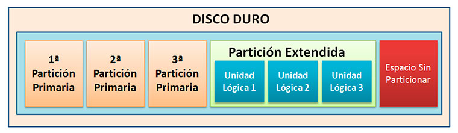
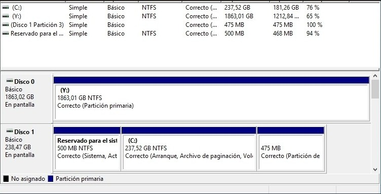

# 🎂 Particiones | Montaje de volúmenes | LVM

En cualquier sistema operativo, el almacenamiento no se usa directamente hay que prepararlo. 
Antes de guardar archivos, los discos deben **organizarse** y **dividirse** en zonas llamadas particiones, donde se **crean** y **montan** los sistemas de archivos. 
Comprender este proceso es esencial para cualquier profesional que gestione servidores o entornos Linux, ya que de él depende la seguridad y la flexibilidad del almacenamiento.

- En **Windows**, las unidades suelen identificarse con letras (C:, D:, E:).
- En sistemas como **Linux o macOS**, todo el sistema de archivos se estructura como un árbol único, donde los dispositivos se integran bajo un mismo punto raíz (/). 

<div align="center">  </div>

### 🗄️ El proceso de montaje (mounting)

Consiste en asignar un sistema de archivos físico a un directorio lógico dentro de ese árbol.

Montar un disco externo en /mnt/disco permite acceder a sus archivos desde esa carpeta.
Si se desmonta (umount /mnt/disco), la carpeta sigue existiendo, pero el contenido del disco deja de ser visible.

Cada punto de montaje es una "ventana" hacia un sistema de archivos. Esto otorga enorme flexibilidad, ya que puedes montar diferentes discos o particiones en distintas rutas sin que el usuario perciba una ruptura entre ellos.

*¿Qué es /mnt/disco y umount /mnt/disco?*

- `/mnt/disco` → es una carpeta del sistema (punto de montaje)  
- `mount` → conecta un disco a esa carpeta  
- `umount` → desconecta ese disco de la carpeta

> La carpeta no contiene los datos, solo es el “punto de acceso” al disco.

### 🪟 Equivalente en Windows

En Windows normalmente usamos:

```text
C:, D:, E:
```

<div align="center">  </div>

### 📋 El papel del particionado

Un disco físico se puede dividir en particiones para separar datos del sistema, copias de seguridad, o zonas específicas (/home, /var, /boot). 

En Linux, los dispositivos se identifican como:
* Discos -> `/dev/sda`, `/dev/sdb`. 
* Particiones -> `/dev/sda1`, `/dev/sda2`.
  
Cada partición se puede formatear con un sistema de archivos diferente (EXT4, XFS, Btrfs, etc.), lo que permite adaptar el rendimiento y la seguridad a las necesidades del sistema.

---

## LVM: flexibilidad sobre el particionado tradicional

En sistemas modernos, el esquema de particiones fijo tiene limitaciones. ¿Qué ocurre si el espacio de /home se agota pero /var tiene gigas libres? 
Con el sistema clásico, habría que reparticionar el disco, lo que implica riesgo y tiempo de inactividad.

**Ahí entra LVM (Logical Volume Manager):** una capa de abstracción entre los discos físicos y los sistemas de archivos que ofrece una gestión mucho más flexible.
LVM funciona agrupando los discos o particiones físicas en un grupo de volúmenes (Volume Group, VG). De ese grupo se crean volúmenes lógicos (Logical Volumes, LV), que se comportan como si fueran particiones normales, pero que pueden redimensionarse fácilmente, incluso en caliente, sin afectar los datos. 

*Por ejemplo:*

Puedes tener tres discos de 1 TB cada uno, combinarlos en un solo grupo de volúmenes de 3 TB y crear dentro volúmenes lógicos para /home, /var y /srv.
Si /home necesita más espacio, puedes ampliarlo con el comando lvextend sin interrumpir el servicio.
Este enfoque convierte la administración de discos en un proceso dinámico y escalable, ideal para servidores, entornos de virtualización o empresas en crecimiento.

**Ventajas de LVM**

* **Flexibilidad total:** redimensionar particiones sin necesidad de formatear.
* **Gestión avanzada:** crear instantáneas (snapshots) para realizar backups o pruebas sin interrumpir el servicio.
* **Agregación de almacenamiento:** varios discos se comportan como una sola unidad.
* **Extensibilidad:** añadir discos nuevos sin reinstalar el sistema.
  
*En definitiva, LVM ofrece una gestión "modular" del almacenamiento, con bloques que pueden ampliarse o modificarse.*

---


Esquema Visual

Descripción del diagrama:
Los discos físicos se dividen en particiones y se inicializan como volúmenes físicos
(PVs).
Varios PV se agrupan en un Volume Group (VG), que actúa como un "pool" de
espacio total disponible.
A partir del VG se crean Logical Volumes (LVs), que se formatean y montan como
particiones tradicionales.
Estos LV pueden ampliarse, reducirse o duplicarse mediante snapshots, sin tener
que tocar los discos físicos.
Este modelo aporta elasticidad al almacenamiento: puedes modificar el tamaño de
los volúmenes "en vivo", algo impensable con el particionado convencional.

Caso de Estudio
Red Hat Enterprise Linux (RHEL)
Contexto
Desde hace más de una década, Red Hat Enterprise Linux (RHEL) 4y su derivado CentOS4
emplean LVM como esquema predeterminado de particionado en sus instalaciones de
servidor. En entornos corporativos, los sistemas deben crecer, migrarse o reorganizarse sin
interrumpir servicios críticos.

vgextend vgdata /dev/sdb
lvextend -l +100%FREE /dev/vgdata/var
resize2fs /dev/vgdata/var
Estrategia
Red Hat adoptó LVM para permitir que los administradores:
Redimensionen volúmenes en caliente, por ejemplo,
cuando una base de datos o un directorio de logs empieza
a llenarse.
Agreguen nuevos discos físicos a un grupo existente sin
reinstalar.
Creen snapshots temporales para realizar backups
consistentes sin detener aplicaciones.
Los comandos clave (vgcreate, lvcreate, lvextend, lvremove)
permiten gestionar esta flexibilidad con unas pocas líneas de
terminal.
Por ejemplo, si /var está al límite, basta con:

En segundos, el sistema gana espacio disponible sin
necesidad de reiniciar.

Resultado
Este modelo ha permitido
a miles de
administradores de
sistemas en entornos
RHEL y CentOS adaptar el
almacenamiento a las
necesidades reales del
negocio, reduciendo
tiempos de inactividad y
simplificando tareas de
mantenimiento.
Hoy, incluso
distribuciones orientadas
al usuario (Ubuntu,
Fedora, openSUSE)
ofrecen LVM como opción
recomendada durante la
instalación.

23

Herramientas y Consejos

Archivo /etc/fstab:
Define qué sistemas de archivos se montan automáticamente al iniciar el sistema.
Ejemplo de entrada típica:
/dev/mapper/vgdata-home /home ext4 defaults 0 2
Es recomendable usar UUIDs o nombres de LVM en lugar de rutas de dispositivo para
evitar errores si cambian las letras del disco.

Comandos esenciales de LVM:
pvcreate: inicializa una partición como volumen físico.
vgcreate: crea un grupo de volúmenes a partir de PVs.
lvcreate: genera un volumen lógico.
lvextend / lvreduce: aumenta o reduce su tamaño.
lvdisplay, vgdisplay: muestran información detallada.

Práctica recomendada:
Mantén una pequeña partición independiente para /boot fuera de LVM. Algunos
gestores de arranque no pueden acceder directamente a volúmenes lógicos.
Documenta tus puntos de montaje y tamaños; los errores en /etc/fstab pueden
impedir que el sistema arranque correctamente.

24

Herramientas visuales:
GParted: particionado gráfico que muestra visualmente las unidades y puntos de
montaje.
Cockpit (Red Hat/Fedora): interfaz web para gestionar LVM, discos y redes de forma
intuitiva.
Webmin o YaST (openSUSE) también permiten operaciones sobre volúmenes LVM sin
usar terminal.

Montaje manual y automático:
Para montar temporalmente un sistema de archivos:
sudo mount /dev/vgdata/home /mnt/home
Para hacerlo permanente, edita /etc/fstab y añade la entrada correspondiente.

Snapshots en LVM:
Permiten crear una imagen del volumen lógico en un momento determinado. Muy útil
antes de aplicar actualizaciones o migraciones.
Ejemplo:
lvcreate --size 2G --snapshot --name snap_home /dev/vgdata/home
Si algo sale mal, puedes revertir con lvconvert --merge /dev/vgdata/snap_home.

Comprende la estructura base:
Discos físicos 3 PV 3 VG 3 LV 3 sistema de archivos 3 montaje. Es el flujo de creación
que siempre se debe respetar.

